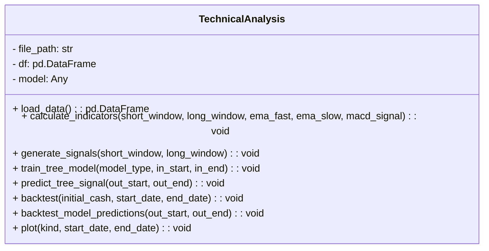
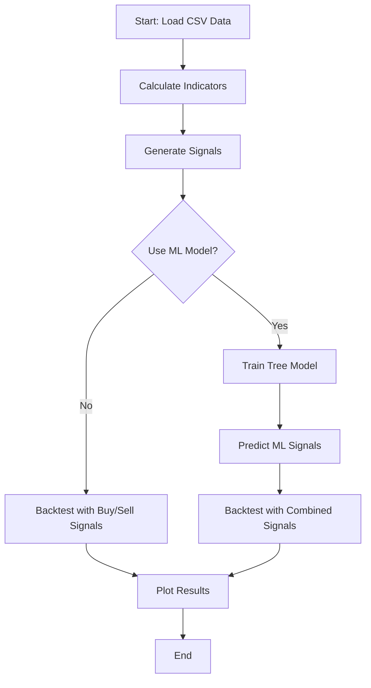

# Overview
The project consists of two part. The first part is Technical Analysis, which reads stock price data from an Excel file and generates a time-series plot of stock prices over time. The second part is Muti-Factor Analysis, which reads fundamental and technical factors and stock returns data, generating a linear relationship between factors and return, and using the model to give score to each stock which gennerate the portfolio.

# First Part: Technical Analysis

## Requirements
Make sure you have the following Python libraries installed:
```
pip install pandas matplotlib openpyxl
```

## How to Use
Place the Excel file (NVIDIA Stock Price History.xlsx) in the same folder as the script.
Run the script using:

## Packages to work with:

- Pandas
- Numpy
- matplolib
- ...

# UML + ML Integration Report for TechnicalAnalysis

## Overview
This project implements an Object-Oriented Programming (OOP) approach to technical analysis on stock price data, enriched with machine learning for improved signal accuracy.

---

## UML Class Design (Abstracted)




---

## Class Responsibilities

### `TechnicalAnalysis`
- **load_data**: Reads CSV data, processes dates and volume
- **calculate_indicators**: Computes SMA, EMA, MACD, RSI, candlestick patterns
- **generate_signals**: Derives trading signals from indicators
- **train_tree_model**: Uses `XGBoost` or `LightGBM` to train a regressor on in-sample signal data
- **predict_tree_signal**: Applies trained model to generate out-sample ML-based signals
- **backtest**: Simulates trades, computes portfolio performance metrics
- **plot**: Visualizes price, indicators, and strategy performance

---

## ML Integration Strategy

### Input Features:
- Eight technical signals: `sma_buy`, `macd_buy`, `rsi_buy`, `bullish`, `sma_sell`, `macd_sell`, `rsi_sell`, `bearish`
- Features are lagged (t-1) to avoid lookahead bias

### Target:
- `y = (Price[t+1] > Price[t])`
- Binary classification: 1 = Up, 0 = Down

### Model Options:
- `XGBRegressor` or `LGBMRegressor`
- Controlled via `MODEL_TYPE` parameter

---

## Flowchart:



# Second Part: Muti-Factor Analysis


## End
