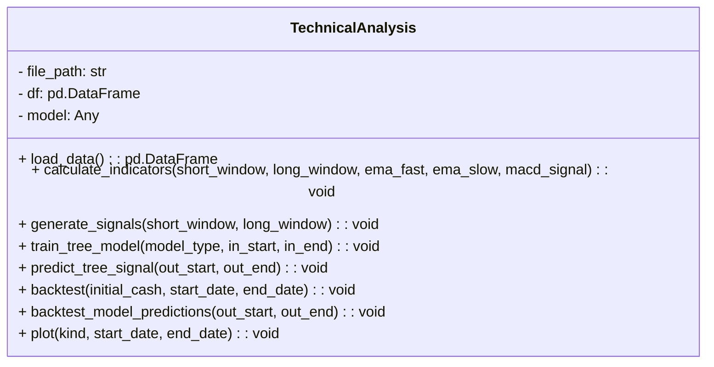
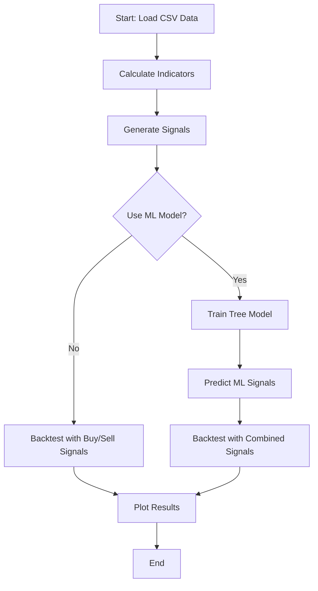

# Overview
The project consists of two part. The first part is Technical Analysis, which reads stock price data from an Excel file and generates a time-series plot of stock prices over time. The second part is Muti-Factor Analysis, which reads fundamental and technical factors and stock returns data, generating a linear relationship between factors and return, and using the model to give score to each stock which gennerate the portfolio.

# First Part: Technical Analysis

## Requirements
Make sure you have the following Python libraries installed:
```
pip install pandas matplotlib openpyxl
```

## How to Use
Place the Excel file (NVIDIA Stock Price History.xlsx) in the same folder as the script.
Run the script using:

## Packages to work with:

- Pandas
- Numpy
- matplolib
- ...

# UML + ML Integration Report for TechnicalAnalysis

## Overview
This project implements an Object-Oriented Programming (OOP) approach to technical analysis on stock price data, enriched with machine learning for improved signal accuracy.

---

## UML Class Design (Abstracted)




---

## Class Responsibilities

### `TechnicalAnalysis`
- **load_data**: Reads CSV data, processes dates and volume
- **calculate_indicators**: Computes SMA, EMA, MACD, RSI, candlestick patterns
- **generate_signals**: Derives trading signals from indicators
- **train_tree_model**: Uses `XGBoost` or `LightGBM` to train a regressor on in-sample signal data
- **predict_tree_signal**: Applies trained model to generate out-sample ML-based signals
- **backtest**: Simulates trades, computes portfolio performance metrics
- **plot**: Visualizes price, indicators, and strategy performance

---

## ML Integration Strategy

### Input Features:
- Eight technical signals: `sma_buy`, `macd_buy`, `rsi_buy`, `bullish`, `sma_sell`, `macd_sell`, `rsi_sell`, `bearish`
- Features are lagged (t-1) to avoid lookahead bias

### Target:
- `y = (Price[t+1] > Price[t])`
- Binary classification: 1 = Up, 0 = Down

### Model Options:
- `XGBRegressor` or `LGBMRegressor`
- Controlled via `MODEL_TYPE` parameter

---

## Flowchart:



# Second Part: Multi-Factor Analysis

## Overview
The Multi-Factor Analysis module builds a systematic stock selection and portfolio prediction model by combining multiple financial and technical indicators.  
The goal is to **identify alpha-generating factors**, **build a predictive model** for returns, and **simulate long-short portfolios** to validate performance.

---

## Requirements
Make sure you have the following Python libraries installed:

```
pip install pandas numpy matplotlib scikit-learn statsmodels yfinance openpyxl
```

How to Use
Place your Fundamental Factors and Technical Factors CSV files into a designated folder (/factors/).

Place your stock returns CSV file (returns.csv) into the project root directory.

Execute the following pipeline step-by-step:

Step 1: Factor Gathering and Cleaning

Step 2: Single Factor Testing (IC, Rank IC, Long-Short Testing)

Step 3: Collinearity Analysis

Step 4: Factor Combination

Step 5: Multi-Factor Modeling and Prediction

Step 6: Portfolio Backtesting and Evaluation

Packages Used
pandas – Data loading and manipulation

numpy – Mathematical operations

matplotlib – Data visualization

scikit-learn – Preprocessing and regression modeling

statsmodels – Cross-sectional regression and neutralization

yfinance – (Optional) Real-time stock data fetching

openpyxl – Excel file handling

Modules Description

Module	Purpose
factor_gathering.py	Load and align raw factor data into standardized matrices.
data_processing.py	Winsorize, neutralize (vs. resivol), and z-score standardize factors.
single_factor_testing.py	Evaluate individual factor predictive power (IC, RankIC, Long-Short PnL).
collinearity_analysis.py	Check and visualize factor multicollinearity.
factor_combination.py	Merge thematically similar factors into composite indicators.
multi_factor_model.py	Train cross-sectional linear models for daily return prediction.
backtesting.py	Simulate long-short portfolios based on model predictions.
Workflow
text
复制
编辑
Load Fundamental and Technical Factors
↓
Data Cleaning and Standardization
↓
Single Factor Testing
↓
Collinearity Analysis
↓
Factor Combination
↓
Multi-Factor Model Training
↓
Predict Stock Scores
↓
Portfolio Construction (Long-Short)
↓
Backtesting and Evaluation
Modeling Strategy
Factor Preprocessing
Winsorize extreme values (2.5% - 97.5%).

Neutralize against residual volatility (resivol).

Standardize factors using z-scoring.

Single Factor Screening
Calculate daily Information Coefficient (IC) and Rank IC.

Perform long-short simulation based on factor ranking.

Select top-performing factors based on IC stability and long-short return.

Collinearity Control
Analyze factor beta correlations and cross-sectional correlations.

Remove or combine highly correlated factors to improve model robustness.

Multi-Factor Model
Train daily cross-sectional OLS regressions on in-sample (INS) data.

Predict out-of-sample (OOS) stock returns using averaged model coefficients.

Normalize predicted stock scores to maintain market neutrality.

Portfolio Backtesting
Long top-N scoring stocks and short bottom-N scoring stocks daily.

Equal weighting within long and short legs.

Evaluate portfolio returns, Sharpe ratio, maximum drawdown, and volatility.

Outputs
/cleaned_factors/ — Cleaned and standardized factor datasets

/single_factor_reports/ — IC and long-short return plots for each factor

/collinearity_analysis/ — Correlation heatmaps and collinearity analysis

/combined_factors/ — Composite factor files after merging

/multi_factor_predictions/ — Out-of-sample predicted stock return scores

/backtesting_results/ — Long-short portfolio returns and performance statistics

Key Performance Metrics
Information Coefficient (IC) – Measures correlation between factor scores and future returns.

Rank Information Coefficient (Rank IC) – Rank-based IC.

Annualized Return – Compounded yearly portfolio return.

Annualized Volatility – Yearly standard deviation of returns.

Sharpe Ratio – Return-to-risk ratio.

Maximum Drawdown – Largest peak-to-trough decline.

Daily Win Rate – Percentage of days with positive long-short returns.


## End
